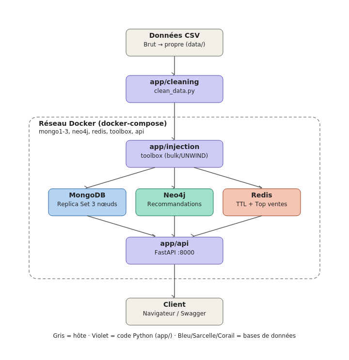

# E-commerce NoSQL — Architecture Polyglotte


Projet académique (module Bases de Données NoSQL) : back-end d'une plateforme
e-commerce combinant **MongoDB** (catalogue/commandes), **Neo4j** (moteur de
recommandation) et **Redis** (sessions TTL + top ventes temps réel), chaque
technologie choisie pour le type de requête qu'elle sert le mieux.

## Architecture



Le pipeline complet : un CSV brut de 101 500 transactions est nettoyé
(`app/cleaning`), injecté en masse dans les 3 bases (`app/injection`), puis
exposé via une API REST (`app/api`) — le tout orchestré par Docker Compose.

## Résultats clés

| Indicateur | Valeur |
|---|---|
| Lignes brutes traitées | 101 500 |
| Lignes propres conservées | 94 982 (93,6 %) |
| Documents injectés dans MongoDB | 94 982, 0 échec, ≈ 6,6 s (bulk_write) |
| Relations créées dans Neo4j | 92 962, ≈ 34,3 s (UNWIND) |
| Rate limiting | 60 req/min par IP (Redis, INCR/EXPIRE) |
| Résilience | Élection automatique d'un nouveau primaire Mongo testée en conditions réelles |

## Démarrage rapide

### Prérequis
- [Docker Desktop](https://www.docker.com/products/docker-desktop/)
- Python 3.12+

### Installation
```bash
git clone <url-de-ce-depot>
cd ecommerce-nosql
cp .env.example .env

python -m venv venv
source venv/bin/activate          # Windows : venv\Scripts\activate
pip install -r requirements.txt
```

### 1. Démarrer l'infrastructure
```bash
docker compose up -d
docker compose ps        # tout doit être "healthy" (sauf mongo-setup : "Exited (0)")
```

### 2. Nettoyer les données brutes
```bash
python -m app.cleaning.clean_data
```
Génère `data/clean_transactions.csv` et `data/errors.log` (non versionnés,
reproductibles à partir de `data/ecommerce_raw_transactions_dirty.csv`).

### 3. Injecter dans les 3 bases
```bash
docker compose build toolbox
docker compose run --rm toolbox python -m app.injection.sync_pipeline
```
*(Tourne dans un conteneur Docker, pas dans le venv local, car les scripts
doivent résoudre les noms internes `mongo1`/`mongo2`/`mongo3` du réseau
Docker.)*

### 4. Lancer l'API
```bash
docker compose up -d --build api
```
Documentation interactive : http://localhost:8000/docs

## Structure du dépôt

```
ecommerce-nosql/
├── docker-compose.yml     # Replica Set Mongo (3 nœuds) + Neo4j + Redis + API
├── Dockerfile             # image Python pour l'injection et l'API
├── .env.example           # configuration à copier en .env
├── data/                  # CSV brut (versionné) + CSV nettoyé (généré)
├── mongodb/               # bootstrap du Replica Set + création des index
├── app/
│   ├── cleaning/          # Étape 1 — nettoyage & validation (pandas)
│   ├── injection/         # Étape 2 — chargement en masse (bulk/UNWIND/pipeline)
│   └── api/               # Étape 3 — FastAPI (agrégations, recommandations, rate limiting)
├── docs/                  # schéma d'architecture
└── report/                # rapport complet (rapport_projet_nosql.pdf)
```

## Choix techniques

| Base | Rôle | Pourquoi |
|---|---|---|
| MongoDB | Catalogue, commandes | Pas de JOIN : une commande et ses articles tiennent dans un seul document |
| Neo4j | Recommandations | Navigation naturelle entre entités liées (Client → Produit → Client) |
| Redis | Sessions TTL, top ventes | Latence quasi nulle, structures natives adaptées au temps réel |

Détails complets (théorème CAP, modélisation, limites identifiées) dans
[`report/rapport_projet_nosql.pdf`](report/rapport_projet_nosql.pdf).

## Test de résilience

```bash
docker exec -it mongo1 mongosh --eval "rs.status().members.forEach(m => print(m.name, m.stateStr))"
docker stop mongo1        # coupe le primaire en pleine écriture
# -> un nouveau primaire (mongo2 ou mongo3) est élu automatiquement
docker compose up -d mongo1   # le nœud revient comme secondaire
```

Procédure détaillée et explication du compromis CAP :
[`report/rapport_projet_nosql.pdf`](report/rapport_projet_nosql.pdf) (section 7).
## Auteurs

- Binôme : Ange Fabrice OPIGAS/MIDOUMBI NZOGHE Alex Aimé/Biroungou T lilian
- Module : Bases de Données NoSQL